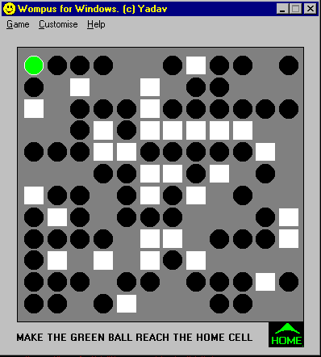



## Wompus \- Board Game

### Description

A Complete Game To Enjoy. (30 different varitions)

Play using keyboard arrow keys. Source code is compatible with all Visual Basic Versions (VB1 to VB6). Note that the code is not suitable for beginner programmers because it is sparsely commented.
 
### More Info
 

             |
---                |---
**Submitted On**   |2004-06-03 21:56:24
**By**             |[been\_lucky](https://github.com/Planet-Source-Code/PSCIndex/blob/master/ByAuthor/been-lucky.md)
**Level**          |Intermediate
**User Rating**    |4.0 (8 globes from 2 users)
**Compatibility**  |VB 3\.0, VB 4\.0 \(16\-bit\), VB 4\.0 \(32\-bit\), VB 5\.0, VB 6\.0
**Category**       |[Games](https://github.com/Planet-Source-Code/PSCIndex/blob/master/ByCategory/games__1-38.md)
**World**          |[Visual Basic](https://github.com/Planet-Source-Code/PSCIndex/blob/master/ByWorld/visual-basic.md)
**Archive File**   |[Wompus\_\-\_B175460672004\.zip](https://github.com/Planet-Source-Code/been-lucky-wompus-board-game__1-54202/archive/master.zip)

